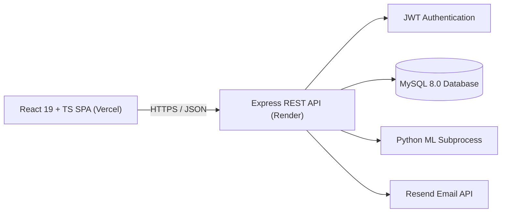
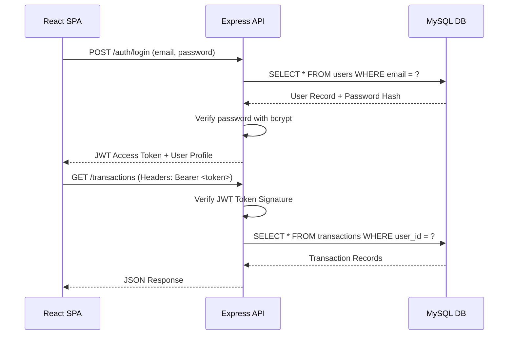
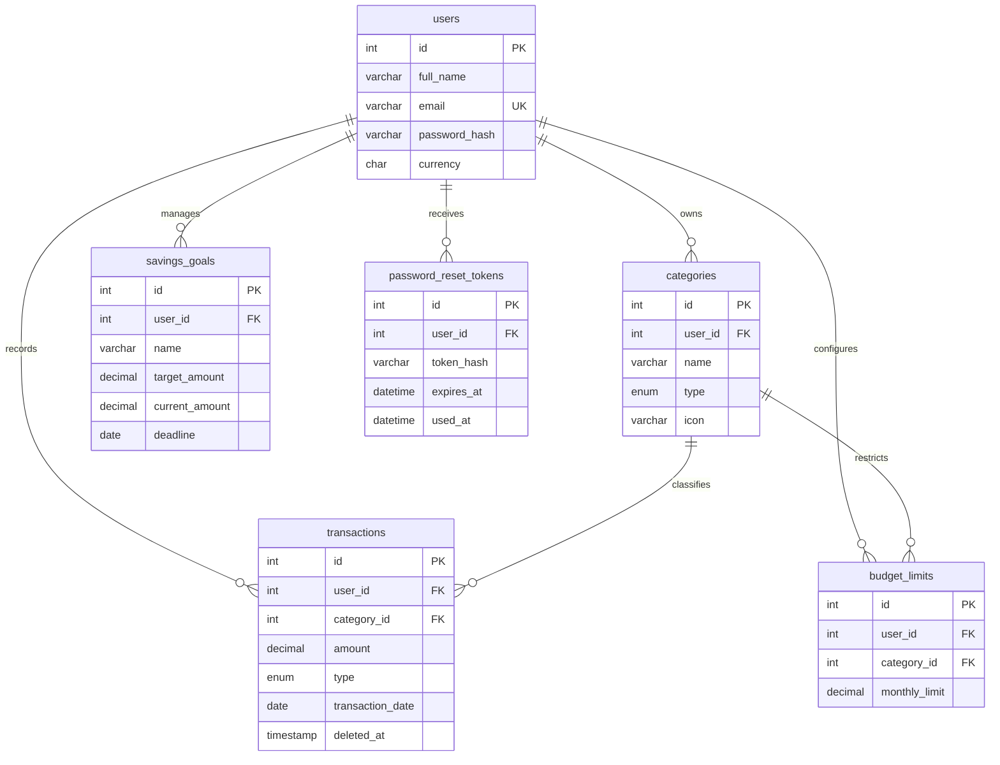

# FinSight

[](https://fin-sight-beta-dusky.vercel.app)
[](LICENSE)
[](https://react.dev/)
[](https://expressjs.com/)
[](https://www.mysql.com/)

**FinSight** is a full-stack personal finance management platform built with React 19, TypeScript, Express.js, and MySQL. It features interactive data analytics, automated budgeting, savings goal tracking, and ML-powered spending forecasts.

🌐 **Live Application:** [https://fin-sight-beta-dusky.vercel.app](https://fin-sight-beta-dusky.vercel.app)  
⚙️ **Backend API:** [https://finsight-backend-zsz3.onrender.com](https://finsight-backend-zsz3.onrender.com)

---

## Key Features

- 🔐 **Authentication & Security** — JWT-based authentication, bcrypt password hashing, protected routes, and email-based password resets powered by the Resend API.
- 💳 **Transaction Management** — Full CRUD ledger supporting income and expense tracking, category selection, multi-keyword search, date/month filtering, and soft-delete/restore capabilities.
- 📊 **Budget Limits & Goal Tracking** — Category-level monthly spending caps with live utilization progress bars, plus interactive savings goals with step-deposit funding.
- 📈 **Financial Dashboard & Analytics** — 12-month cashflow visualization, net savings rates, category expense distributions, and downloadable PDF account statements.
- 🤖 **AI/ML Spending Insights** — Machine learning spending predictions (Linear Regression time-series forecasting), behavioral spending category suggestions, and pattern clustering.
- 📱 **Responsive Dark-Mode Interface** — Sleek glassmorphism UI built with React 19, TypeScript, Tailwind CSS, Recharts, and TanStack Query, accessible across Desktop, Tablet, and Mobile viewports.

---

## Tech Stack

| Layer | Technologies & Libraries |
| :--- | :--- |
| **Frontend** | React 19, TypeScript, Vite, TanStack Query v5, Recharts, Lucide Icons, React Hook Form, Zod, Tailwind CSS |
| **Backend** | Node.js, Express.js, JWT (`jsonwebtoken`), `bcrypt`, `mysql2` (Prepared Statements), `pdfkit` |
| **Database** | MySQL 8.0 (6 Relational Tables with Foreign Keys, Cascading Deletes, Unique Constraints, and Composite Indexes) |
| **Email Service** | Resend API (Transactional emails for password reset verification) |
| **Machine Learning** | Python 3, `scikit-learn` (Linear Regression, K-Means Clustering, TimeSeriesSplit) |
| **Deployment** | Vercel (Frontend SPA with URL rewrites), Render (Express.js API), MySQL Cloud Database |

---

## Architecture & System Design

FinSight uses a decoupled client-server architecture. The React single-page application communicates with the Node.js/Express backend via a RESTful JSON API. Heavy machine-learning computations are offloaded to an isolated Python service spawned on demand.


```mermaid
flowchart LR
    UI["React 19 + TS SPA (Vercel)"]
    API["Express REST API (Render)"]
    AUTH["JWT Authentication"]
    DB[("MySQL 8.0 Database")]
    ML["Python ML Subprocess"]
    EMAIL["Resend Email API"]

    UI -->|HTTPS / JSON| API
    API --> AUTH
    API --> DB
    API --> ML
    API --> EMAIL
```

### Authentication Flow


```mermaid
sequenceDiagram
    participant Client as React SPA
    participant Server as Express API
    participant DB as MySQL DB

    Client->>Server: POST /auth/login (email, password)
    Server->>DB: SELECT * FROM users WHERE email = ?
    DB-->>Server: User Record + Password Hash
    Server->>Server: Verify password with bcrypt
    Server-->>Client: JWT Access Token + User Profile

    Client->>Server: GET /transactions (Headers: Bearer <token>)
    Server->>Server: Verify JWT Token Signature
    Server->>DB: SELECT * FROM transactions WHERE user_id = ?
    DB-->>Server: Transaction Records
    Server-->>Client: JSON Response
```

---

## Repository Structure

```text
FinSight/
├── frontend/             # React 19 + TypeScript SPA
│   ├── src/
│   │   ├── api/          # Axios API service instances
│   │   ├── components/   # Modular UI components & modals
│   │   ├── contexts/     # Auth & global state providers
│   │   ├── hooks/        # Custom React hooks
│   │   ├── pages/        # Dashboard, Transactions, Goals, Budgets, Analytics, Insights, Settings
│   │   ├── types/        # TypeScript interfaces & types
│   │   └── utils/        # Formatting & currency helpers
│   ├── package.json
│   └── vite.config.ts
│
├── server/               # Express.js REST API Backend
│   ├── controllers/      # Route controllers (Auth, Tx, Goals, Budgets, Analytics, ML)
│   ├── routes/           # Express router endpoints
│   ├── database/         # MySQL database initialization schemas
│   ├── ml/               # Python ML scripts & evaluation pipeline
│   ├── utils/            # JWT middleware & email service
│   ├── db.js             # MySQL connection pool
│   ├── app.js            # Express app configuration & middleware
│   ├── server.js         # HTTP server entry point
│   └── package.json
│
├── vercel.json           # Vercel SPA routing rules
└── README.md
```

---

## API Overview

All protected endpoints require an `Authorization: Bearer <token>` header.

### Authentication & Account
- `POST /auth/register` — Register a new user account
- `POST /auth/login` — Authenticate credentials and issue JWT
- `GET /auth/me` — Retrieve current authenticated user profile
- `POST /auth/forgot-password` — Request password reset email
- `POST /auth/reset-password` — Reset password using token

### Transactions Ledger
- `GET /transactions` — Fetch user transactions (supports `month`, `year`, `limit`)
- `POST /transactions` — Create new transaction record
- `GET /transactions/:tx_id` — Fetch single transaction details
- `PUT /transactions/:tx_id` — Update existing transaction
- `DELETE /transactions/:tx_id` — Soft-delete transaction (`deleted_at = NOW()`)
- `POST /transactions/:tx_id/restore` — Restore soft-deleted transaction
- `GET /transactions/deleted/recent` — Fetch recently deleted transactions

### Savings Goals & Budgets
- `GET /goals` | `POST /goals` | `PUT /goals/:goal_id` | `DELETE /goals/:goal_id` — Goal CRUD
- `POST /goals/:goal_id/fund` — Deposit funds into savings goal
- `POST /goals/:goal_id/complete` — Mark savings goal completed
- `POST /goals/:goal_id/cancel` — Mark savings goal cancelled
- `GET /budgets` | `POST /budgets` | `PUT /budgets/:budget_id` | `DELETE /budgets/:budget_id` — Budget cap CRUD
- `GET /budgets/utilization` — Get category spending vs monthly limits

### Dashboard, Analytics & System
- `GET /dashboard` — Financial overview metrics and monthly summary
- `GET /analytics/trends` — 12-month historical cashflow aggregations
- `GET /categories` — Fetch available spending and income categories
- `POST /report/generate` — Generate downloadable A4 PDF financial statement
- `GET /currency/rates` — Live multi-currency conversion rates
- `GET /health` — Application health & Resend service configuration status

### ML Insights
- `GET /insights/predict` — Next-month spending prediction (Linear Regression)
- `GET /insights/suggest-category` — Automated expense category classification
- `GET /insights/cluster` — Behavioral spending cluster analysis
- `GET /insights/all` — Aggregate analytical data feed for ML pipeline

---

## Database Design


```mermaid
erDiagram
    users {
        int id PK
        varchar full_name
        varchar email UK
        varchar password_hash
        char currency
    }
    categories {
        int id PK
        int user_id FK
        varchar name
        enum type
        varchar icon
    }
    transactions {
        int id PK
        int user_id FK
        int category_id FK
        decimal amount
        enum type
        date transaction_date
        timestamp deleted_at
    }
    savings_goals {
        int id PK
        int user_id FK
        varchar name
        decimal target_amount
        decimal current_amount
        date deadline
    }
    budget_limits {
        int id PK
        int user_id FK
        int category_id FK
        decimal monthly_limit
    }
    password_reset_tokens {
        int id PK
        int user_id FK
        varchar token_hash
        datetime expires_at
        datetime used_at
    }

    users ||--o{ categories : "owns"
    users ||--o{ transactions : "records"
    users ||--o{ savings_goals : "manages"
    users ||--o{ budget_limits : "configures"
    users ||--o{ password_reset_tokens : "receives"
    categories ||--o{ transactions : "classifies"
    categories ||--o{ budget_limits : "restricts"
```

---

## Application Gallery

| Dashboard Overview | Transaction Ledger |
|:---:|:---:|
|  |  |

| Savings Goals | Budget Limits |
|:---:|:---:|
|  |  |

| Financial Analytics | User Settings |
|:---:|:---:|
|  |  |

---

## Local Setup & Installation

### Prerequisites
- **Node.js:** v18.0.0 or higher
- **MySQL:** v8.0 or higher
- **Python:** v3.10 or higher (Optional for ML service)

### 1. Clone Repository
```bash
git clone https://github.com/ShivShah018/FinSight.git
cd FinSight
```

### 2. Database Initialization
Import the schema into your local MySQL server:
```bash
mysql -u root -p < server/database/schema_railway.sql
```

### 3. Server Configuration & Startup
```bash
cd server
npm install
```
Create a `.env` file inside the `server/` directory:
```env
FINSIGHT_DB_HOST=localhost
FINSIGHT_DB_PORT=3306
FINSIGHT_DB_USER=root
FINSIGHT_DB_PASSWORD=your_mysql_password
FINSIGHT_DB_NAME=finsight
JWT_SECRET_KEY=your_secure_jwt_secret
API_PORT=8000
RESEND_API_KEY=re_your_resend_api_key
```
Start the backend server:
```bash
npm start
```
*Backend server will listen on `http://localhost:8000`.*

### 4. Frontend Startup
Open a new terminal window:
```bash
cd frontend
npm install
npm run dev
```
*Frontend application will launch at `http://localhost:5173`.*

---

## Engineering Highlights & Design Rationale

- **Decoupled SPA / REST Architecture:** Frontend and backend are completely decoupled. The SPA communicates exclusively via JSON HTTP requests, enabling independent deployments on Vercel and Render.
- **SQL Security & Performance:** All database interactions use prepared statements via `mysql2` to prevent SQL injection. Composite indexes (`idx_user_date`) accelerate range queries across multi-year transaction ledgers.
- **Soft Delete Pattern:** Deleted transactions maintain audit compliance by populating `deleted_at = NOW()`. Users can instantly undo accidental deletions from the UI.
- **Decoupled ML Subprocess:** Express spawns an isolated Python process communicating via JSON over stdin/stdout, eliminating heavy native Python dependencies from the Node.js runtime.

---

## License

This project is licensed under the [MIT License](LICENSE).
